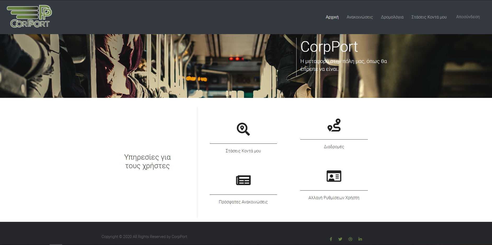
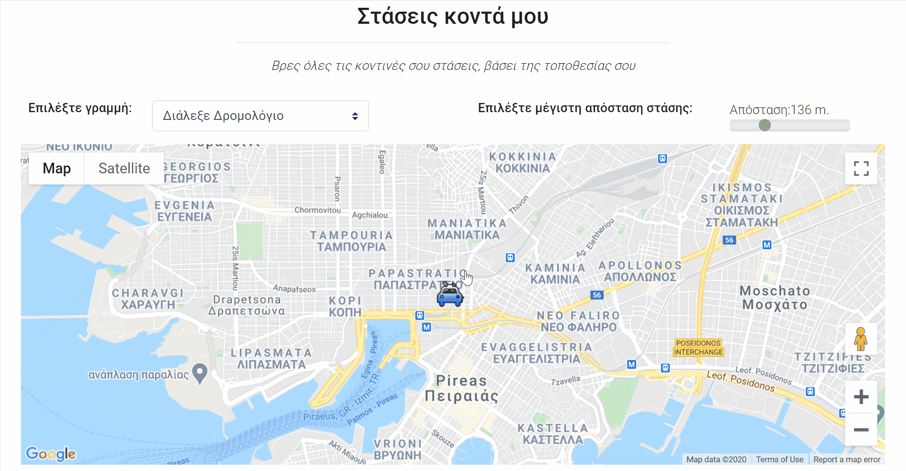

# Transit Route Visualizer
Bus route visualizer utilizing the open source data of [OASA](http://geodata.gov.gr/en/dataset/oasa) the Athens,Greece public bus company.  
Website of a pseudo-company (CorpPort) offering bus rides to customers, closest station and route visualizations and member authentication/login features.

# Transit Route Visualizer
Bus route visualizer utilizing the open source data of [OASA](http://geodata.gov.gr/en/dataset/oasa) the Athens,Greece public bus company.  
Website of a pseudo-company (CorpPort) offering bus rides to customers, closest station and route visualizations and member authentication/login features.  
**Front page (after login)**

**Stops near by**

**Bus Routes**

Frontend : @antonymarg  
Backend and visualization js : @mageirakos
  
## Installation  
1)	Install MongoDB : https://docs.mongodb.com/manual/administration/install-community/
2)	Install NodeJS : https://nodejs.org/en/download/  
3)	Open bash and  
a.	`git clone https://github.com/mageirakos/transit-route-visualizer.git`     
b.	`cd web_ece_upatras`      
c.	`npm install`    

### Setup the database:   
1)	To open a mongo server write  ` mongod` on a terminal
2)  You need to have created a path `/data/db` somewhere under the root directory
3)	In a different terminal move to the repository installation directory and
    -	`mongorestore --db bus_ece  /dump/bus_ece`    

* Note: You might have to install database tools to run mongorestore: https://www.mongodb.com/try/download/database-tools
* Any `/bin` folders of Mongo Community Server and the database tools need to be on the PATH
  

## Deployment   
1) Make sure that the database has been correctly installed by checking is through the MongoDB Compaass. ( Installed optionally as you are downloading the community server)
2) Make sure your server is up and running
3) Move over to the repo directory and `node app.js` on the terminal    
4) GOTO localhost:3000  

Frontend : @antonymarg
Backend and visualization js : @mageirakos

  
## Installation  
1)	Install MongoDB : https://docs.mongodb.com/manual/administration/install-community/
2)	Install NodeJS : https://nodejs.org/en/download/  
3)	Open bash and  
a.	`git clone https://github.com/mageirakos/transit-route-visualizer.git`     
b.	`cd web_ece_upatras`      
c.	`npm install`    

### Setup the database:   
1)	To open a mongo server write  ` mongod` on a terminal
2)  You need to have created a path `/data/db` somewhere under the root directory
3)	In a different terminal move to the repository installation directory and
    -	`mongorestore --db bus_ece  /dump/bus_ece`    

* Note: You might have to install database tools to run mongorestore: https://www.mongodb.com/try/download/database-tools
* Any `/bin` folders of Mongo Community Server and the database tools need to be on the PATH
  

## Deployment   
1) Make sure that the database has been correctly installed by checking is through the MongoDB Compaass. ( Installed optionally as you are downloading the community server)
2) Make sure your server is up and running
3) Move over to the repo directory and `node app.js` on the terminal    
4) GOTO localhost:3000  

